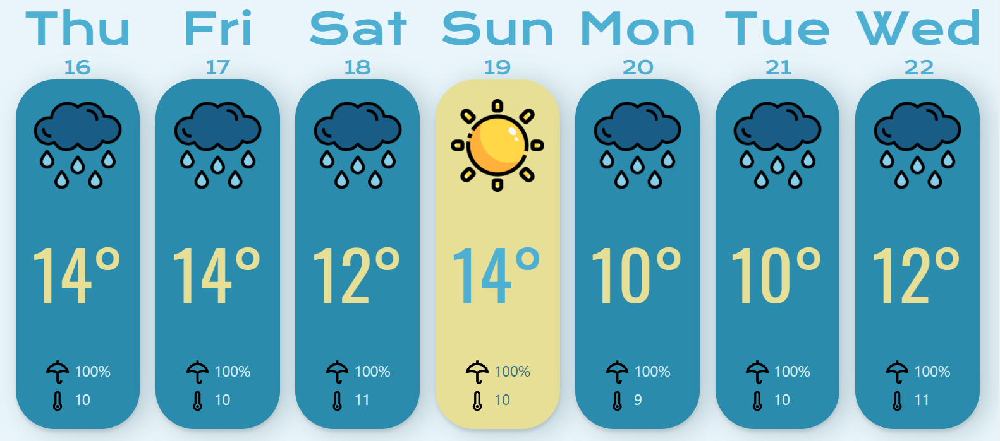

<div id="top"></div>
<!--
*** Thanks for checking out the Best-README-Template. If you have a suggestion
*** that would make this better, please fork the repo and create a pull request
*** or simply open an issue with the tag "enhancement".
*** Don't forget to give the project a star!
*** Thanks again! Now go create something AMAZING! :D
-->


<!-- PROJECT SHIELDS -->
<!--
*** I'm using markdown "reference style" links for readability.
*** Reference links are enclosed in brackets [ ] instead of parentheses ( ).
*** See the bottom of this document for the declaration of the reference variables
*** for contributors-url, forks-url, etc. This is an optional, concise syntax you may use.
*** https://www.markdownguide.org/basic-syntax/#reference-style-links
-->


<!-- PROJECT LOGO -->
<br />
<div align="center"> 

<h3 align="center">Weather Application</h3>

  <p align="center">    
    <br />    
    <br />
    <br />
    <a href="https://github.com/voiceinthedark/weather-app-js-advent">View Demo</a>
    ·
    <a href="https://github.com/voiceinthedark/weather-app-js-advent/issues">Report Bug</a>
    ·
    <a href="https://github.com/voiceinthedark/weather-app-js-advent/issues">Request Feature</a>
  </p>
</div>


<!-- TABLE OF CONTENTS -->
<details>
  <summary>Table of Contents</summary>
  <ol>
    <li>
      <a href="#about-the-project">About The Project</a>
      <ul>
        <li><a href="#built-with">Built With</a></li>
      </ul>
    </li>
    <li>
      <a href="#getting-started">Getting Started</a>
      <ul>
        <li><a href="#prerequisites">Prerequisites</a></li>
        <li><a href="#installation">Installation</a></li>
      </ul>
    </li>
    <li><a href="#usage">Usage</a></li>
    <li><a href="#roadmap">Roadmap</a></li>    
    <li><a href="#license">License</a></li>
    <li><a href="#contact">Contact</a></li>
    <li><a href="#acknowledgments">Acknowledgments</a></li>
  </ol>
</details>


<!-- ABOUT THE PROJECT -->
## About The Project



<p align="right">(<a href="#top">back to top</a>)</p>


### Built With

* [React.js](https://reactjs.org/)

<p align="right">(<a href="#top">back to top</a>)</p>


<!-- GETTING STARTED -->
## Getting Started

### Prerequisites


* npm
  ```sh
  npm install npm@latest -g
  ```

### Installation

1. Get a free API Key at [https://openweathermap.org/](https://openweathermap.org/)
2. Get a free API key at [locationiq](https://locationiq.com/)
3. Clone the repo
   ```sh
   git clone https://github.com/voiceinthedark/React-Weather.git
   ```
4. Install NPM packages
   ```sh
   npm install
   ```
5. Create a `.env` file at the root directory
then add:

   ```javascript
    REACT_APP_JSCHALLENGE08_API_KEY= 'open weather map key'
    REACT_APP_GEOCODING_API_KEY= 'locationiq key'
   ```

<p align="right">(<a href="#top">back to top</a>)</p>


<!-- USAGE EXAMPLES -->
## Usage

1. Use the command
   ```sh
   npm start
   ```
2. open the browser at `http://localhost:3000`

<p align="right">(<a href="#top">back to top</a>)</p>


<!-- ROADMAP -->
## Roadmap

- [x] Track location by geolocation
- [ ] Make user input city name to retrieve weather forcast
- [ ] Make the user click on a given day bar to go to a detailed day view

See the [open issues](https://github.com/voiceinthedark/React-Weather/issues) for a full list of proposed features (and known issues).

<p align="right">(<a href="#top">back to top</a>)</p>

<!-- LICENSE -->
## License

Distributed under the MIT License. See `LICENSE.txt` for more information.

<p align="right">(<a href="#top">back to top</a>)</p>


<!-- CONTACT -->
## Contact

Firas Abbas - darkrisingforce@gmail.com

Project Link: [https://github.com/voiceinthedark/React-Weather](https://github.com/voiceinthedark/React-Weather)

<p align="right">(<a href="#top">back to top</a>)</p>

<!-- ACKNOWLEDGMENTS -->
## Acknowledgments

* [Open weather map](https://openweathermap.org/)
* [Locationiq](https://locationiq.com/)
* [flaticon](https://www.flaticon.com/)

<p align="right">(<a href="#top">back to top</a>)</p>
